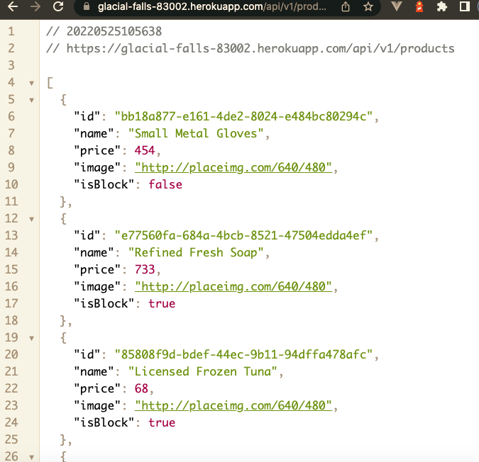

# Curso de Backend con Node.js: API REST con Express.js

## [Ver la app en producción](https://glacial-falls-83002.herokuapp.com/api/v1/products)

### Deploy en Heroku
### [Documentación Heroku](https://www.heroku.com)
